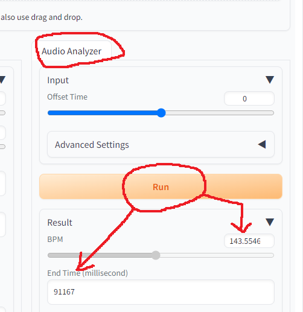
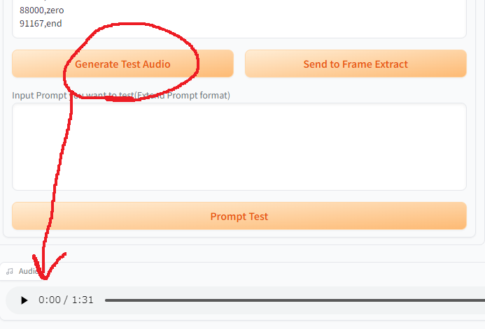
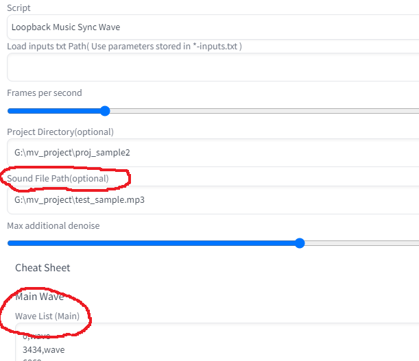
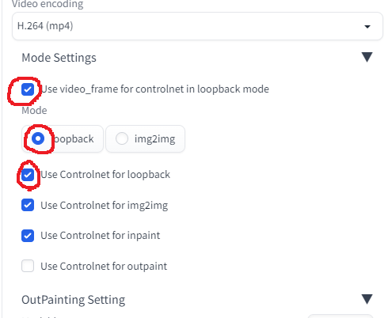

# sd_loopback_music_sync_wave

## Overview
#### AUTOMATIC1111 UI extension for creating videos using img2img.  
#### This extension was created based on [Loopback Wave Script](https://github.com/FizzleDorf/Loopback-Wave-for-A1111-Webui)  
#### The major changes are that the wave length can be set one by one in milliseconds and that wildcard can be used.  
#### In addition, I have added various @function.  

## Example
- The following sample is raw output of this extension.(The file was too large, so I compressed it.)  
#### sample 1  
```
Extend Prompts:
1::#zoom(@wave_amplitude(0.8,1.6))
2::$random_xy(3434, 0.2,0.2, 3000)
3::#rot_y(@wave_amplitude(60,0))

Sub Extend Prompts:
1::@@bpm139@1700[#slide_x(1, @random(1.5,2), @random(0.2,0.8))]
3::@@bpm139@1700[#slide_y(1, @random(1.5,2), @random(0.2,0.8))]
5::@@bpm139@1700[#slide_x(1, @random(-1.5,-2), @random(0.2,0.8))]
7::$random_xy(99999, 1,1, 3000),$random_slide_x(99999,1,0.5,0.5,0.5,3000),$random_slide_y(99999,1,0.5,0.5,0.5,3000)
-1::(__expression__:@wave_shape(1.0,0))
```
<div><video controls src="https://user-images.githubusercontent.com/118420657/235941290-2708913c-16c0-4f3a-82db-7ab729ea7ea8.mp4" muted="false"></video></div>
<br>

#### sample 2  
- Loopback mode(default) + Controlnet(open pose)  
- All the parts except for the main prompt are taken from sample 1.  
<div><video controls src="https://user-images.githubusercontent.com/118420657/236166342-6b2457a0-7d4e-4dd5-9964-0d3293c8dc9c.mp4" muted="false"></video></div>
<br>

#### sample 3  
- img2img mode + Controlnet(open pose)  
- The setting is exactly the same as sample2 except mode is changed to img2img.  
<div><video controls src="https://user-images.githubusercontent.com/118420657/236167376-e914c244-c5fc-453d-9b20-32a80c53b9af.mp4" muted="false"></video></div>
<br>

#### sample 4  
- SAM + Controlnet(open pose)  
- Using [SAM](https://github.com/continue-revolution/sd-webui-segment-anything) to dynamically generate mask from text, then inpaint with mask
```
4-15::(__hair-female__: 1.2)
4-15::$inpaint("hair")
20-31::(__clothing__: 1.0)
20-31::$inpaint("clothing")
32::(spiderman:1.5)
33::(wonder woman:1.5)
34::(storm:1.5)
35::(harley_quinn:1.5)
32-35::$inpaint("face")
```
<div><video controls src="https://user-images.githubusercontent.com/118420657/236435879-a07eca27-a443-4888-9f66-8f8027167480.mp4" muted="false"></video></div>

<br>

#### sample 5  
TODO optical flow sample


## Installation  
- Use the Extensions tab of the webui to [Install from URL]  

<br>
<br>

## Basic Usage  
- Go to [txt2img] tab.  
- Generate some image. (I recommend to make with Euler a / 20 steps / cfg 7)  
- Press [Send to img2img] Button  
- Go to [img2img] tab.  
- Lower the [Denoising strength]. (I recommend 0.25)  
- Select [Loopback Music Sync Wave] in Script drop list  
- Copy the following text into the [Wave List (Main)]  
```
0,wave  
1000,wave  
2000,wave  
3000,wave  
3500,wave  
4000,wave  
4500,wave  
5000,end  
```
- Copy the following text into the [Extend Prompt (Main)]. The wildcards used below are those provided by default.  
```
-1::__lb_vel_slow__  
-1::__lb_zoom_wave__  
-1::__lb_prompt_face__  
```
- Press [Generate]  
- (Default file output location, video encoding settings, etc. are the same as in the original script)  

<br>
<br>

## Advanced Usage  

### How to generate video synchronized to music  
1. Preparing music file  
First, bring the music file. If you are not familiar with it, you may want to make it about 10 seconds long.  

<br>

2. Find the correct bpm for a music file  
(See [Here](https://www.audionetwork.com/content/the-edit/expertise/what-is-bpm-and-how-to-find-it) for a description of bpm.)  
If you know how to find bpm, please skip this section.  
   - Enter the path to the music file in the following location.  
     
   - Press [Run] at the following location  
     
Now we know the bpm and exact length in milliseconds. But this bpm is almost certainly not accurate.  
Find the correct bpm by following these steps  
   - Enter the values you just calculated for [BPM] and [End Time] and 1 for [Beat Per Wave].
Cut off any fraction of a bpm.  
     
   - Press [Generate]  
   - The waveform image is generated at the bottom, so download it locally and enlarge it  
   - Look at where the red line is drawn in the lower figure. This red line is the bpm interval.  
     
   - In this image, the red lines seem to be spaced too short. Decrease the value of [BPM] and press [Generate] again   
   - Repeat this procedure to find the [BPM] value that results in the following.  
     
   - Finally, press [Generate Test Audio] to play the generated audio file and check if the metronome sound and music are not out of sync.  
     
   
<br>

3. Generate wave list along bpm
   - Enter the values obtained in the above procedure in the [BPM] and [End Time] fields.  
   - Set [Beat Per Wave] to 4 for now. This makes one wave as long as 4 beats.  
   - Press [Generate]  
     
   - The automatically generated wave list is output to [Wave List] immediately below.  

<br>

4. Write prompt along the wave list
   - Copy the wave list to [Wave List (Main)] in the [img2img] tab.  
   - Enter the path of the music file in the [Sound File Path(optional)]  
     
   - write prompt in [Prompt Changes (Main)][Extend Prompt (Main)].Click on [Cheat Sheet] to see the format  
   - Also, by using @function, you can also write how to change along the shape of the wave  
```
in [Extend Prompt (Main)]
0,2,4::cat
1::(smile:1.0)
2::(smile:@wave_amplitude(0,1.0))
3-5::#vel_x(@wave_amplitude(0.05,0.2))
-1::__back_ground__, __animal__
```

<br>

5. How to check prompts  
Video generation takes a long time, so it is recommended to check the prompt before proceeding with the actual generation  
   - Enter the music file path as you did in "Find the correct bpm" and press the [Run] button in Audio Analyzer.  
   - Copy the wave list to the following location and enter the prompt you wish to check  
     
   - Press [Prompt Test] to update the waveform image  
   - Note that the numbers are normalized for graphical display. This function is for viewing a rough shape.  
   - As an example, try the following prompt  
```
0,2,3::#vel_x(1)
```
     
```
-1::#zoom(@wave_amplitude(@random(0.8,1.0),@random(1.3,1.6)))
```
     

<br>

6. Add sub wave list  
[Wave List (Sub)] is an additional wave list that does not affect denoising strength.  
It is recommended to use the wave list generated in [Beat Per Wave] 1 or the wave list generated in [Wave List(Generated from Onset Time)] in [Audio Analyzer]  

<br>


### How to replace the initial image in the middle of the process  
- The initial image can be replaced on a wave-by-wave basis.  
- Create an empty directory as a project directory and create a [video_frame_per_wave] directory in it.  
- In it, put a png file with the name of the index of the wave you want to correspond to. For example, if you have [project_dir/video_frame_per_wave/2.png], the image will be switched at the timing of the wave with index 2.   
- If the image contains png info, the prompt will also be overwritten.
- It might be interesting to make a video with images you picked up at random somewhere.  

<br>

### @#$function list  
- The list of functions and how to write the wave list are described in [Cheat Sheet].  


<br>


### img2img mode (sample 3)  
- As an added bonus, img2img mode is implemented. You can switch between loopback and img2img in [Mode Settings].
- The original frame required for img2img must be generated by the following procedure. (If you want to use controlnet in loopback mode as in sample2, you should also generate frames using this procedure.)  


<br>


### loopback + controlnet (sample 2)  
- Set [Allow other script to control this extension](https://github.com/s9roll7/ebsynth_utility#note-2--how-to-use-multi-controlnet-together) True.
- Configure the controlnet itself as you normally use it, set it to enable, then configure the preprocessor and mode settings  
- Create the initial image. Create a normal img2img image of the very first frame of the video and [Send to Img2Img]. You should set denoising strength to 0.7 or a higher value. Also, generate the image with the control net enabled.  
- Specify the same path in [Project Directory(optional)] as specified in the frame creation procedure above.  
- Make the following settings in [Mode Settings]
- Change the denoising strength to a setting for video generation.  
- Generate  



<br>

### optical flow (sample 5)
TODO

<br>

### How to generate mask from text (sample 4)  
- You need [SAM Extension](https://github.com/continue-revolution/sd-webui-segment-anything)  
- It is necessary to be able to use SAM and GroundingDINO together  
- Refer to sample 4 for $inpaint function usage.  

<br>

### Other Tips  
- If you specify the *-inputs.txt that is created at the same time as creating the video in [Load inputs txt Path], you can create the video again with the same input as last time  
- If you want to reuse only some of the inputs, open *-prompt.txt and copy only where you need it
- If you want to add more wildcards yourself,
Put them in [extensions/sd_loopback_music_sync_wave/wildcards]. If you are too lazy to make your own, you can pick them up at civitai.  
- If you want to make a video only for the first 5 seconds in the test, temporarily add "5000, end" to the wave list entered in [Wave List (Main)]  
- The unit of velocity for function parameters is the number of screens per second. For example, a speed of 1.0 in the x-axis direction means that if the screen moves at the same speed for one second, it will scroll one horizontal screen. In the case of rotation speed, it is the degree per second.  
- There are three ways to increase the resolution.  
  1. Do img2img with a higher resolution from the beginning.  
  2. Use [Upscale Settings].  
  3. Upscale the generated video using an external tool.  
1 is probably the best way to get the best results, but it also takes the most processing time.
- There are two ways to increase fps for smooth animation  
  1. Put a larger value in [Frames per second]  
  2. Interpolate with an external tool  
1 is very effective, but the processing time will be proportionally longer.  
